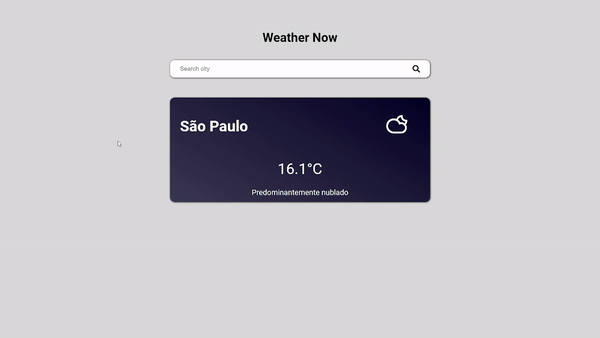

     

# Weather Now 

Application responsible for returning the temperature and weather conditions of the researched place

>Note: Developed just to measure my progress with Vanilla Js. 

## Technologies Used

- HTML;
- CSS;
- JavaScript;

## Links

Click [Here](https://weather-now-lka.netlify.app/) to access the application.

---

Developed by <strong>Leandro Koshoji Araujo</strong>

   📫 leandrokoshoji@gmail.com

